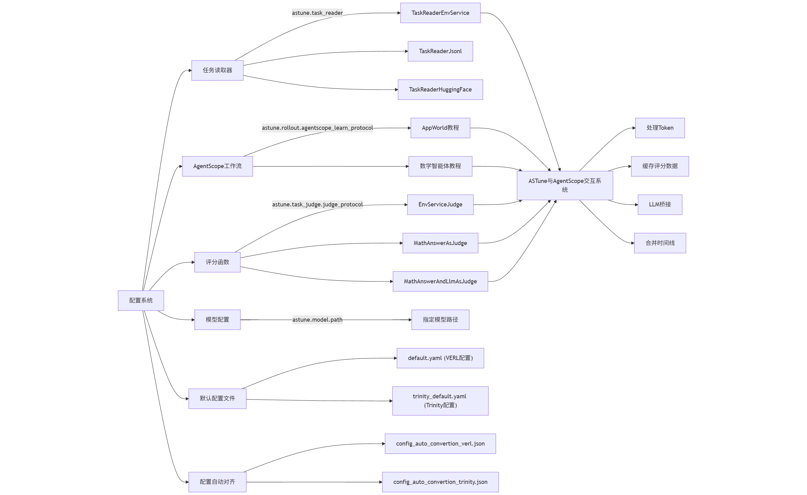

# AgentScope Tune

AgentScope Tune, or **ASTune**, is an advanced agent training framework for tuning AgentScope workflow and agent(s).


## Installation

We recommend using `uv` to setup the dependencies, and `conda` can also do the job.

1. Clone the repo and trinity module:
    ```bash
    git clone https://github.com/..../agentscope-tune.git astune
    git clone https://github.com/binary-husky/Trinity-RFT astune/external/trinity
    cd astune
    ```

2. Install trinity training backbone:
    ```bash
    # Create virtual environment
    uv venv --python=3.10.16
    source .venv/bin/activate
    git clone https://github.com/binary-husky/Trinity-RFT external/trinity
    git clone https://github.com/binary-husky/agentscope external/agentscope

    # Install dependencies
    uv pip install --upgrade pip setuptools packaging -i https://mirrors.aliyun.com/pypi/simple/
    uv pip install -r scripts/requirements_trinity.txt -i https://mirrors.aliyun.com/pypi/simple/ --no-deps --prerelease=allow
    uv pip install -e external/trinity -i https://mirrors.aliyun.com/pypi/simple/ --no-deps
    # uv pip install -e external/agentscope -i https://mirrors.aliyun.com/pypi/simple/
    uv pip install agentscope==1.0.7 -i https://mirrors.aliyun.com/pypi/simple/


    # Install flash attention (must be installed at last)
    uv pip install --verbose flash-attn ring-flash-attn -i https://mirrors.aliyun.com/pypi/simple/ --no-deps --no-build-isolation
    ```


## Get Started (Public)

We provide a rich library of examples and they are good guides to get started!
Let see:

- How to build an Agent specialized at gsm8k math problems, and [how to train it 🚀](tutorial/math_agent.md).
- How to build an Appworld agent using AgentScope, and [how to train it 🪐](tutorial/appworld.md).
- How to build a Werewolves RPG agent using AgentScope, and [how to train it 🚀](tutorial/werewolves/werewolves.md)


## Get Started (Department)

本节仅内部沟通使用，后期重写。

项目提供一个多功能launcher用于调试和训练，借助launcher，只需要修改一个`--backbone`参数，就选择任意训练框架启动训练 or 调试。

1. 使用launcher进行全链路调试（--backbone='debug'）：脱离Trinity和Verl，只与Vllm（自动创建）连接，进行调试：
    ```bash
    # （训练math agent demo）建议开始前杀死所有ray、env_service进程 (python launcher.py --kill="python|ray|vllm|VLLM" && ray stop)
    clear && \
    python launcher.py --conf tutorial/example_math_agent/math_agent.yaml --backbone='debug' --with-logview

    # （训练appworld demo）建议开始前杀死所有ray、env_service进程 (python launcher.py --kill="python|ray|vllm|VLLM" && ray stop)
    clear && \
    python launcher.py --with-appworld --conf tutorial/example_appworld/appworld.yaml --backbone='debug' --with-logview
    ```
    备注：当`--backbone=debug`时，程序**不再使用ray**，这意味着您可以编写vscode的launch.json进行便捷的断点调试，launch.json的配置见本文档最后。


2. 使用launcher启动训练：
    ```bash
    # 建议开始前杀死所有ray、vllm、env_service进程 (python launcher.py --kill="python|ray|vllm|VLLM" && ray stop)
    clear && \
    python launcher.py --with-appworld --conf tutorial/example_appworld/appworld.yaml --with-ray --backbone='trinity'

    clear && python launcher.py --conf tutorial/example_math_agent/math_agent.yaml --with-ray --backbone='trinity'
    ```
    备注：如果需要断点调试，请添加参数 `python launcher.py --db='TAG1|TAG2|TAG3' --conf=...`，并在代码中需要断点的地方标记一行特殊代码 `from vsdb import bp; bp("TAG1")` 即可。(需要配合Ray Distributed Debugger VSCode Extension)。此外，也可以使用BeyondAgent后端训练（--backbone='verl'），但目前verl训练后端正在维护中。


## Feature

- 当程序退出时，给自己发短信
    ```bash
    PHONE_NUMBERS="18812341234" python launcher.py ...
    ```

# 简要架构

1. 读取task（对应配置字段 astune.task_reader）
    - astune/task_reader/task_reader_base.py
        - class::TaskReaderEnvService
        - class::TaskReaderJsonl
        - class::TaskReaderHuggingFace

2. 定义 Workflow（对应配置字段 astune.rollout.agentscope_learn_protocol ）
    - tutorial/appworld.py
    - tutorial/math_agent.py

3. 定义评分函数（对应配置字段 astune.task_judge.judge_protocol ）
    - astune/task_judge/judge_base.py
    - astune/task_judge/env_service_as_judge.py
        - class::EnvServiceJudge
    - astune/task_judge/math_answer_as_judge.py
        - class::MathAnswerAsJudge
        - class::MathAnswerAndLlmAsJudge

4. 指定模型（对应配置字段 astune.model.path ）

5. 配置系统（完善中，先凑合着用一下）
    - 默认配置
        - astune/default_config/default.yaml         （ 存储verl的默认训练配置，可以被 --conf 指定的 yaml 以同名配置的形式覆盖 ）
        - astune/default_config/trinity_default.yaml （ 存储trinity默认配置，但可以被 --conf 指定的 yaml 以 trinity.xxx 的形式覆盖 ）
    - 配置自动对齐（定义哪些参数需要自动对齐到verl或者trinity上）
        - astune/default_config/config_auto_convertion_verl.json
        - astune/default_config/config_auto_convertion_trinity.json

6. ASTune 和 AgentScope 交互系统 V0.5
    - astune/context_tracker/agentscope.py 负责
        - 处理AgentScope生成的Token
        - 缓存judge给出评分需要的各种数据（包括但不限于所有对话message，env_service句柄，从astune.task_reader读取的task metadata等）
        - 提供LLM的桥接
        - 负责合并timeline

# note

FlashInfer?

clear && killer VLLM  && killer ray && killer python  && python launcher.py --with-appworld --conf tutorial/example_appworld/appworld.yaml --with-ray --backbone='verl'

clear && killer VLLM  && killer ray && killer python  && python launcher.py --with-appworld --conf tutorial/example_appworld/appworld.yaml --with-ray --backbone='verl'


- `launche.json` for vscode debugging
```json
{

    "version": "0.2.0",
    "configurations": [
        {
            "name": "Python Debugger: Launch rollout",
            "type": "debugpy",
            "request": "launch",
            "program": "launcher.py",
            "console": "integratedTerminal",
            "args": [
                "--backbone",  "debug",
                "--conf", "xxxx/xxxx/xxxx.yaml"
            ],
            "env": {
            }
        },
    ]
}
```


# Develop

<br/>
<br/>
<div align="center">
  
</div>

- [ ] 设计 Judge&Reward 系统
- [ ] 小财场景 Demo
- [ ] 寻找更通用的 tool -> token 兼容方法
- [ ] 设计 数据增广 系统
- [ ] 设计 AgentScopeLearn Protocol V2.0 (以狼人杀为例)
- [ ] 集成 AgentScope Runtime
- [ ] Trinity Display Infer Progress, e.g. token per second
- [ ] Trinity: SFT support
- [ ] AgentScope Studio Intergration
- [ ] AgentScope


# Future

- [x] test server
- [ ] RUBRICS INT
- [-] TEST TOKEN REASON
- [x] TRINITY CONF MAP

```
 python launcher.py --kill="python|ray|vllm|VLLM" && ray stop && clear && python launcher.py --with-appworld --conf tutorial/example_appworld/appworld.yaml --backbone='trinity' --with-ray
```


```
source  .verlvenv/bin/activate

python launcher.py --kill="python|ray|vllm|VLLM" && ray stop && clear  && \
python launcher.py --with-appworld --conf tutorial/example_appworld/appworld.yaml --backbone='verl'


python launcher.py --kill="python|ray|vllm|VLLM" && ray stop   && clear  && python launcher.py --conf tutorial/example_math_agent/math_agent.yaml --with-ray --backbone='verl'


python launcher.py --kill="python|ray|vllm|VLLM" && ray stop   && clear  && python launcher.py --conf tutorial/example_werewolves/werewolves.yaml --backbone='verl'
```
