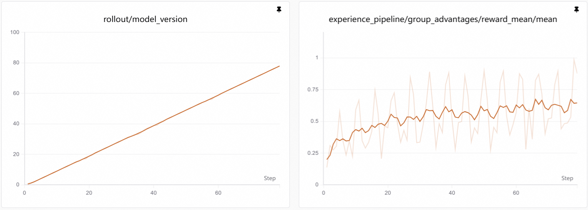
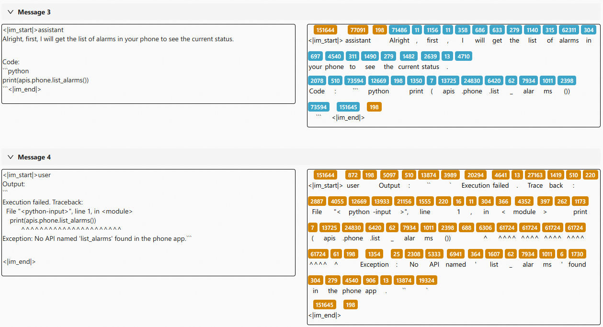
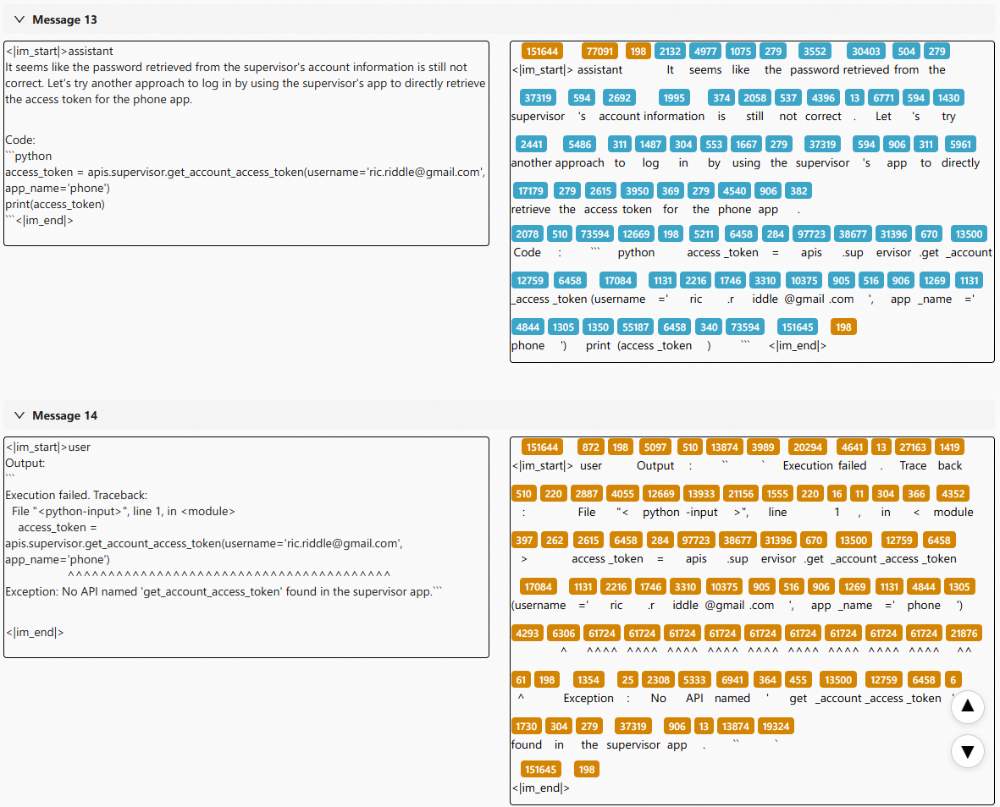
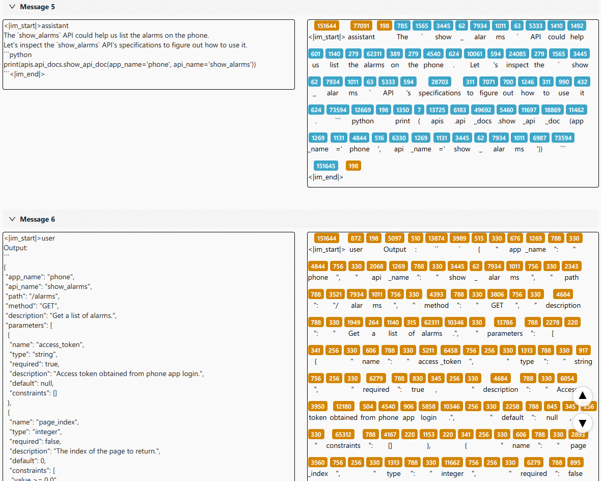
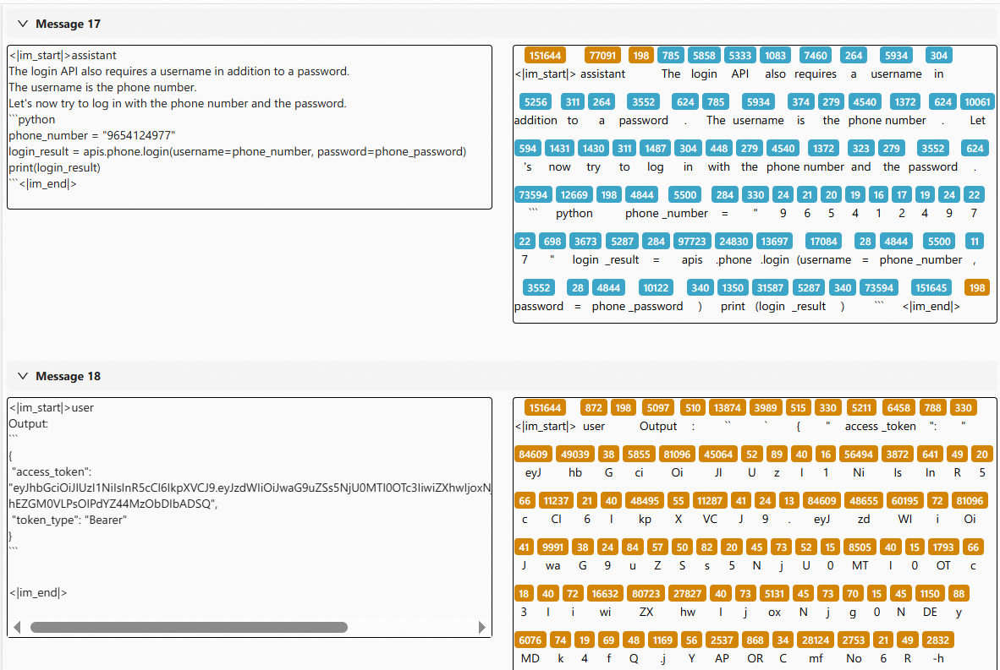

# App World 应用操作示例

本页展示在 AppWorld 场景下，从环境与数据准备、构建 AgentScope Workflow、配置奖励模块（Judge），到完成从调试到正式训练的完整流程。

## 场景概述

- **场景**：Appworld 是一个仿真的应用环境，包含 9 个日常应用，可通过 457 个 API 操作，并预置了 106 个在模拟世界中生活的数字用户行为数据。
- **目标**：训练一个 Agent，能够正确使用这些 APP 并完成指定任务。

## 1. 准备数据集与环境

首先，需要准备 AppWorld 所需的环境服务：

- 下载并部署 `env_service`
- 下载并部署 `appworld`

详细的安装与启动步骤，请参考 [EnvService 文档](https://modelscope.github.io/AgentEvolver/tutorial/install/#step-2-setup-env-service-appworld-as-example)。

## 2. 准备 AgentScope Workflow

AppWorld 示例所使用的 AgentScope Workflow 代码位于：`tutorial/example_appworld/appworld.py`。

代码首先定义了 AgentScope Workflow（将 Agent 的 `model` 设置为 `astune_proxy`）：

```python
agent = ReActAgent(
    name="Qwen",
    sys_prompt=first_msg['content'],
    model=astune_proxy,  # type: ignore
    formatter=DashScopeChatFormatter(),
    memory=InMemoryMemory(),
    toolkit=None,
    print_hint_msg=False,
)

for _ in range(config.astune.rollout.multi_turn.max_steps):
    # AgentScope 负责和环境交互的消息
    reply_message = await agent(interaction_message)
    # env_service 协议：将模型输出发送给环境，作为 action
    obs, _, terminate, _ = astune_proxy.gym_step(
        action={"content": reply_message.content, "role": "assistant"}
    )
    # 使用环境的输出构造新的交互消息
    interaction_message = Msg(name="env", content=obs, role="user")
    # 判断是否终止本次 rollout
    if terminate:
        break
    if astune_proxy.context_overflow:
        break
```

在上述代码中，`astune_proxy` 提供了与 AgentScope 运行时环境交互的接口：

- `astune_proxy.gym_step`：模拟 gym 接口。输入一个 action，返回四元组 `(observation, reward, terminate_flag, info)`。
- `astune_proxy.context_overflow`：检查当前上下文窗口是否已经超过 token 限制。


## 3. 准备 Judge（奖励模块）

在 `astune/task_judge/env_service_as_judge.py` 中，我们直接向 `env_service` 发送 HTTP 请求，并从环境中读取奖励信号。

你也可以参考该文件，为自己的任务实现专用的 Judge 模块。


## 4. 测试与训练

### 4.1 配置 YAML

拷贝并修改 `tutorial/example_appworld/appworld.yaml` 中的关键配置参数。与本文最相关的部分在 yaml 文件中用 ✨✨✨✨ 标出：

1. **读取任务**（对应字段：`astune.task_reader`）
2. **定义 Workflow**（对应字段：`astune.rollout.agentscope_learn_protocol`）
   - 示例：如果 AgentScope Workflow 定义在 `tutorial/example_appworld/appworld.py` 中的 `ExampleAgentScopeLearnProtocol` 类里
   - 则配置：
`astune.rollout.agentscope_learn_protocol = "tutorial.example_appworld.appworld->ExampleAgentScopeLearnProtocol"`
3. **定义评分函数**（对应字段：`astune.task_judge.judge_protocol`）
   - 示例：
`astune.task_judge.judge_protocol = "astune.task_judge.env_service_as_judge->EnvServiceJudge"`
4. **指定模型**（对应字段：`astune.model.path`）

```yaml
astune:
  project_name: appworld_astune
  experiment_name: "read_yaml_name"
  task_judge:
    # ✨✨✨✨ 编写并选择评估函数
    judge_protocol: astune.task_judge.env_service_as_judge->EnvServiceJudge
  model:
    # ✨✨✨✨ 设置需要训练的模型
    path: /mnt/data_cpfs/model_cache/modelscope/hub/Qwen/Qwen/Qwen2___5-14B-Instruct
  rollout:
    # ✨✨✨✨ 编写并选择 Agent
    use_agentscope_protocol: True
    agentscope_learn_protocol: tutorial.example_appworld.appworld->ExampleAgentScopeLearnProtocol
    agentscope_disable_toolcalls: True
  debug:
    debug_max_parallel: 1
    debug_first_n_tasks: 1
```

### 4.2 调试

```bash
# 建议在启动前先杀掉所有 ray 和 env_service 相关进程
# ( python launcher.py --kill="python|ray" )
python launcher.py --conf tutorial/example_appworld/appworld.yaml --backbone='debug' --with-logview
```

当 `--backbone=debug` 时，程序不再使用 Ray。你可以在 VSCode 中配置 `launch.json`，方便进行断点调试。配置示例：

```json
{
    "version": "0.2.0",
    "configurations": [
        {
            "name": "Python Debugger: Launch rollout",
            "type": "debugpy",
            "request": "launch",
            "program": "launcher.py",
            "console": "integratedTerminal",
            "args": [
                "--backbone",  "debug",
                "--with-appworld",
                "--conf", "xxxx/xxxx/xxxx.yaml"
            ],
            "env": {
            }
        }
    ]
}
```

### 4.3 开始训练

在完成调试后，只需要将 `backbone` 切换为 `trinity` 即可启动正式训练：

```bash
# 建议在启动前先杀掉所有 ray、vllm 和 env_service 相关进程
# ( python launcher.py --kill="python|ray|vllm" )
python launcher.py --conf tutorial/example_appworld/appworld.yaml --backbone='trinity'
```

## 5 参考结果



## 6 现象与案例观察

### 调优前：

1. 频繁调用不存在的 API



2. 没有学会按照说明去获取 access token



### 调优后：

1. 会先查阅 API 文档，并学会使用有效的 API



2. 学会正确获取 access token


