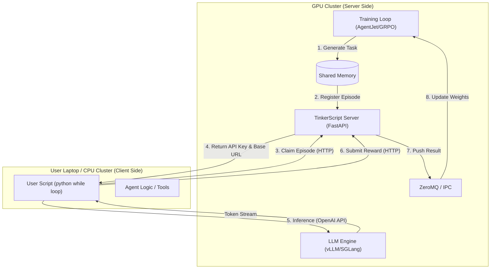
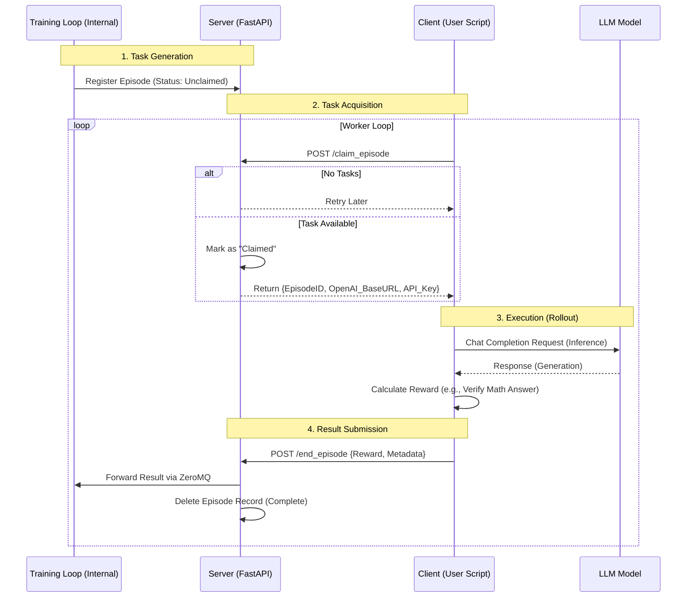
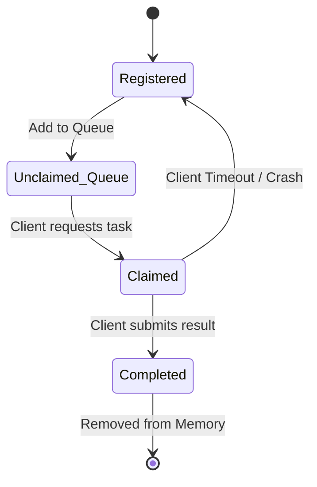

# TinkerScript Design Blueprint / TinkerScript 设计蓝图

[English](#english-version) | [中文](#chinese-version)

---

<a id="english-version"></a>
## 🇬🇧 English Version

### 1. Overview
**TinkerScript** is an experimental component of AgentJet designed to decouple the **Training Logic** from the **Agent Execution Logic**. It allows users to train **full-weight LLM models** on machines without GPUs (e.g., a laptop) by offloading the actual model computation to a remote GPU server.

Unlike traditional setups where the user code must run inside the training cluster, TinkerScript allows you to verify and run your agent logic locally while the heavy lifting (training & inference) happens remotely.


>
> Relationship between **TinkerScript** and **Tinker**:
>
> **No relationship at all** (just like **JavaScript** and **Java**). **TinkerScript** is open-source and free. **Tinker** is close-source and not free.
>

### 2. Core Architecture

The system involves two main parties: the **TinkerScript Server** (running on the GPU cluster) and the **TinkerScript Client** (running on your local machine).



### 3. Detailed Workflow

The workflow relies on a "Claim & Submit" model. The training loop generates tasks ("Episodes") and waits for external workers to pick them up.



### 4. Episode State Machine

To handle network failures or client crashes, the server maintains a state machine for every episode.



*   **Registered**: Task created by the training algorithm.
*   **Claimed**: A client is currently working on it.
*   **Timeout**: If a client claims a task but doesn't report back within `allow_discard_timeout`, the server reverts the status to **Registered** so another client can try.

### 5. Implementation Example

The user experience is designed to be minimal. You simply query the remote server for a "job", do the work, and report the "score".

```python
# User-side Code Concept
def rollout(task):
    # 1. Handshake & Claim (Get credentials for this specific episode)
    api_baseurl_key = tinkerjet_remote.begin_episode()

    # 2. Run your existing agent logic using standard OpenAI format
    workflow_output = execute_agent(task, api_baseurl_key)

    # 3. Submit results
    tinkerjet_remote.end_episode(workflow_output)
    return workflow_output.reward
```
