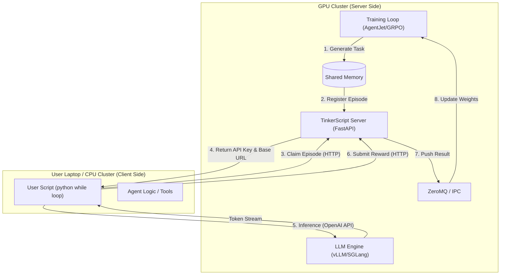
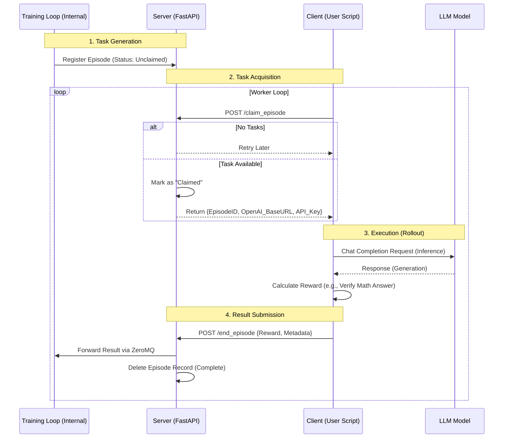
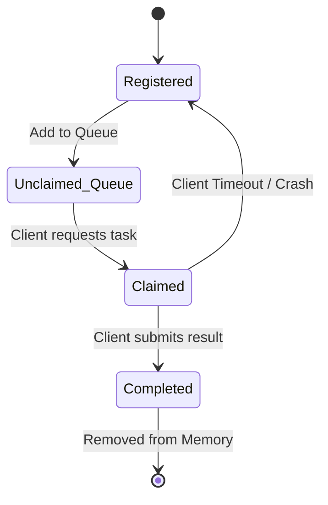
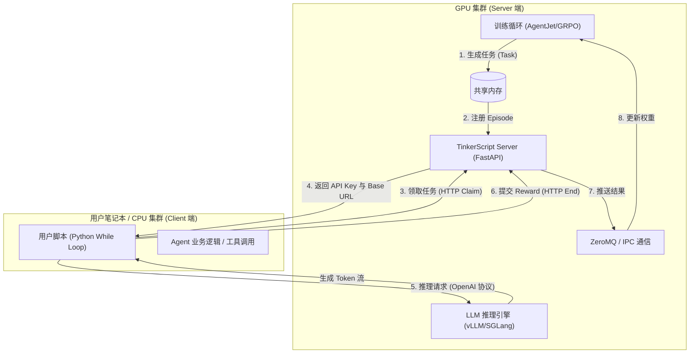
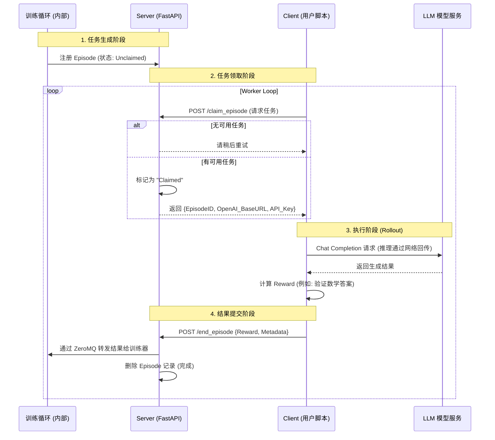
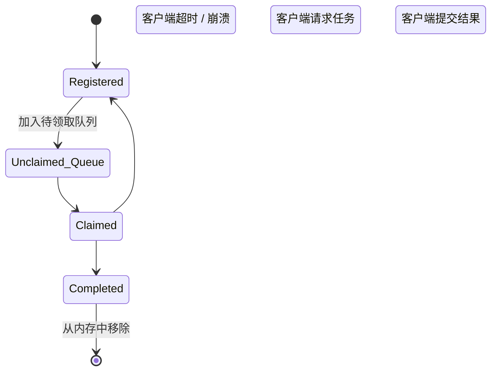

# TinkerScript Design Blueprint / TinkerScript 设计蓝图

[English](#english-version) | [中文](#chinese-version)

---

<a id="english-version"></a>
## 🇬🇧 English Version

### 1. Overview
**TinkerScript** is an experimental component of AgentJet designed to decouple the **Training Logic** from the **Agent Execution Logic**. It allows users to train **full-weight LLM models** on machines without GPUs (e.g., a laptop) by offloading the actual model computation to a remote GPU server.

Unlike traditional setups where the user code must run inside the training cluster, TinkerScript allows you to verify and run your agent logic locally while the heavy lifting (training & inference) happens remotely.

### 2. Core Architecture

The system involves two main parties: the **TinkerScript Server** (running on the GPU cluster) and the **TinkerScript Client** (running on your local machine).



### 3. Detailed Workflow

The workflow relies on a "Claim & Submit" model. The training loop generates tasks ("Episodes") and waits for external workers to pick them up.



### 4. Episode State Machine

To handle network failures or client crashes, the server maintains a state machine for every episode.



*   **Registered**: Task created by the training algorithm.
*   **Claimed**: A client is currently working on it.
*   **Timeout**: If a client claims a task but doesn't report back within `allow_discard_timeout`, the server reverts the status to **Registered** so another client can try.

### 5. Implementation Example

The user experience is designed to be minimal. You simply query the remote server for a "job", do the work, and report the "score".

```python
# User-side Code Concept
def rollout(task):
    # 1. Handshake & Claim (Get credentials for this specific episode)
    api_baseurl_key = tinkerjet_remote.begin_episode()

    # 2. Run your existing agent logic using standard OpenAI format
    workflow_output = execute_agent(task, api_baseurl_key)

    # 3. Submit results
    tinkerjet_remote.end_episode(workflow_output)
    return workflow_output.reward
```

### 6. Limitations

1.  **Strict OpenAI Protocol**: Users must use the OpenAI `base_url` + `api_key` pattern. Internal access (like direct model object access) is not available.
2.  **Implicit Multi-Agent Handling**: AgentJet cannot explicitly distinguish different agents in a multi-agent scenario via API, though it attempts to merge timeline shards automatically.
3.  **No Prompt Tuning**: TinkerScript is designed for full-weight model training, not for soft-prompt tuning.

---

<a id="chinese-version"></a>
## 🇨🇳 中文版本 (Chinese Version)

### 1. 概述 (Overview)
**TinkerScript** 是 AgentJet 的一个实验性组件，旨在将 **训练逻辑 (Training Logic)** 与 **Agent 执行逻辑 (Execution Logic)** 解耦。它允许用户在 **没有 GPU** 的机器上（例如普通笔记本电脑）训练 **全参数 LLM 模型**，计算压力完全由远程 GPU 服务器承担。

与传统的将用户代码嵌入训练集群的方式不同，TinkerScript 允许你在本地运行并验证 Agent 逻辑，通过网络与远程训练循环交互。

### 2. 核心架构 (Core Architecture)

系统包含两个主要部分：运行在 GPU 集群上的 **TinkerScript Server** 和运行在本地的 **TinkerScript Client**。



### 3. 详细工作流 (Detailed Workflow)

基于“领取 (Claim) - 提交 (Submit)”模式。训练循环生成任务（Episode），等待外部 Worker 领取执行。



### 4. 状态机管理 (Episode State Machine)

为了处理网络波动或客户端崩溃（Crash），服务端为每个 Episode 维护了一个状态机。



*   **Registered (已注册)**: 训练算法生成了该任务，等待被执行。
*   **Claimed (已被领取)**: 某个 Client 正在处理该任务。
*   **Timeout (超时)**: 如果 Client 领取任务后在规定时间 (`allow_discard_timeout`) 内未提交结果，服务器会将状态重置为 **Registered**，允许其他 Client 重新领取该任务（容错机制）。

### 5. 实现代码示例

用户侧的代码非常简洁。简而言之：向远程服务器要一个“活儿”，干完活，上报“得分”。

```python
# 用户侧代码概念演示
def rollout(task):
    # 1. 握手 & 领取任务 (获取当前 Episode 专属的鉴权信息)
    api_baseurl_key = tinkerjet_remote.begin_episode()

    # 2. 运行你现有的 Agent 逻辑 (使用标准 OpenAI 接口)
    workflow_output = execute_agent(task, api_baseurl_key)

    # 3. 提交结果
    tinkerjet_remote.end_episode(workflow_output)
    return workflow_output.reward
```

### 6. 局限性 (Limitations)

1.  **严格依赖 OpenAI 协议**: 用户必须使用 OpenAI `base_url` + `api_key` 的方式与模型交互。无法获取模型内部对象（Weights/Gradients）。
2.  **隐式多智能体处理**: 在多智能体（Multi-Agent）场景下，AgentJet 无法通过 API 显式区分不同的 Agent 角色，但后台会尝试自动合并时间线片段。
3.  **不支持 Prompt Tuning**: TinkerScript 专为全量模型微调设计，不支持 Soft-Prompt Tuning 等轻量级微调。
